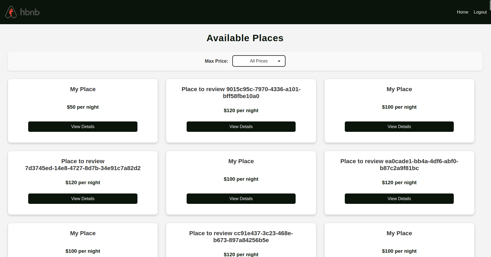
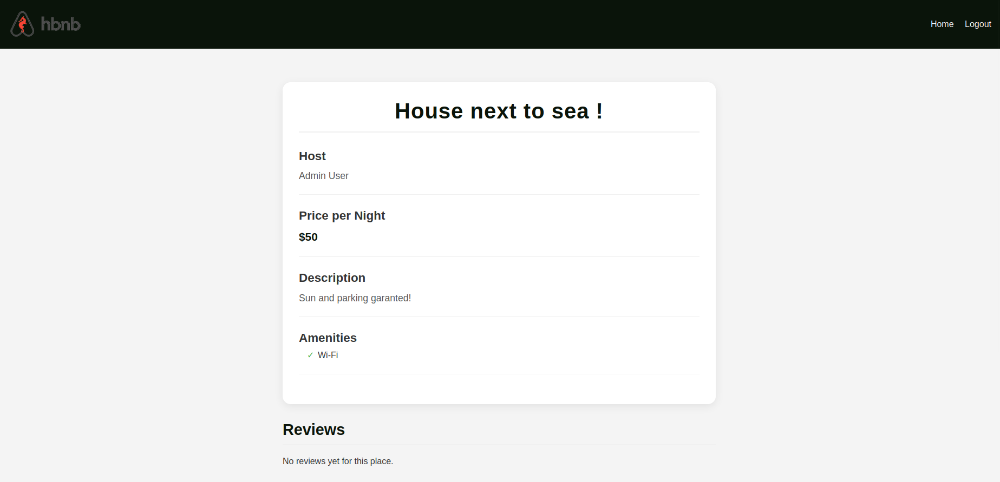
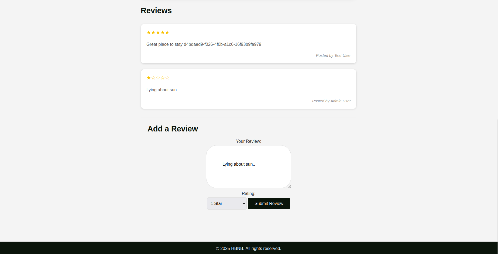

# HBNB Frontend Implementation

## Overview
This project is a frontend implementation of the Holberton School AirBNB clone (HBNB) - a web application that simulates core functionalities of AirBNB. The frontend provides an intuitive interface for users to browse rental properties, view detailed information, filter listings by price, and submit reviews for places they've visited.

## Overview of the website




## Features

### User Authentication
- User login with email and password
- JWT token-based authentication stored in cookies
- Protected routes that redirect unauthenticated users
- Logout functionality

### Property Listings
- Display of available rental properties
- Price filtering functionality
- Responsive card layout (3 cards per row on large screens)
- Hover effects for better user interaction

### Property Details
- Detailed view of individual properties
- Host information with first and last name
- Price per night display
- Property description
- List of amenities with checkmark indicators
- Reviews section

### Review System
- View existing reviews for properties
- Display reviewer names instead of user IDs
- Star-based rating visualization (★)
- Form for submitting new reviews (authenticated users only)
- Client-side validation for review submissions

## Technologies Used
- **HTML5**: Semantic markup for page structure
- **CSS3**: Custom styling with responsive design
- **JavaScript (ES6+)**:
  - DOM manipulation
  - Asynchronous API requests with Fetch API
  - Promise handling with async/await
  - Event handling
  - Form validation
- **JWT Authentication**: Token-based user authentication

## Project Structure

### API Integration
The frontend communicates with a RESTful API using the Fetch API for the following operations:
- **User Authentication**: Login endpoint with JWT token response
- **Places**: Fetching all properties and individual property details
- **Reviews**: Viewing and submitting reviews for properties
- **User Information**: Retrieving user details for display in reviews

All API requests to protected endpoints include an `Authorization` header with the JWT token.

## Setup and Testing Instructions

### Setting Up the Application
1. Clone the repository:
```bash
git clone https://github.com/sebgrgs/Holberton-school-AirBNB.git
cd part4
```

2. Install requirements:
```bash
cd hbnb
pip install -r requirements.txt
```

3. Start the backend API server:
```bash
python3 run.py
```
> This will start the API server on http://localhost:5000

4. Start the frontend (using a simple HTTP server):
```bash
python3 -m http.server 8000
```

5. Open your browser and navigate to:
```
http://localhost:8000
```

### Testing Login Functionality
1. From the home page, click the "Login" link in the top navigation bar
2. You will be redirected to the login page
3. Enter valid credentials:
   - Email: `admin@hbnb.io`
   - Password: `admin1234`
4. Click the "Login" button
5. Verify successful login:
   - You should be redirected to the home page
   - The "Login" link should change to "Logout"
   - You should now have access to protected features
   - Check your browser's cookies to confirm the JWT token was stored

### Testing Review Functionality
**Prerequisites:**
- You must be logged in to submit a review
- The backend API server must be running

1. Navigate to a specific place:
   - From the home page, click "View Details" on any place card
   - This will take you to the place details page

2. Add a review:
   - Scroll down to the "Add a Review" section
   - Enter your review text in the text area
   - Select a rating from the dropdown (1-5 stars)
   - Click the "Submit Review" button

3. Verify review submission:
   - You should see a success message
   - The form should be cleared
   - The page should refresh to show your new review
   - Your review should appear in the reviews list with your name and selected rating
   - The star rating should display correctly

4. Test validation:
   - Try submitting without entering review text or selecting a rating
   - You should see validation errors requiring both fields

### Testing Place Filtering
1. On the home page, locate the "Max Price" filter dropdown
2. Select different price ranges (e.g., "$100 or less")
3. Verify that only places with prices at or below the selected threshold are displayed
4. Select "All Prices" to return to the full listing

## Key JavaScript Functions
- `checkAuthentication()`: Verifies user authentication status
- `loginUser()`: Handles user login and token storage
- `fetchPlaces()`: Retrieves all available properties
- `displayPlaces()`: Renders property cards in the UI
- `filterPlacesByPrice()`: Filters properties based on maximum price
- `fetchPlaceDetails()`: Gets detailed information about a specific property
- `displayPlaceDetails()`: Renders a property's details in the UI
- `fetchPlaceReviews()`: Retrieves reviews for a property
- `displayReviews()`: Renders reviews with star ratings and user names
- `parseJWT()`: Decodes the JWT token to extract user information

## Responsive Design
The application is fully responsive with breakpoints for different screen sizes:
- **Large screens (>900px)**: 3 properties per row
- **Medium screens (600px-900px)**: 2 properties per row
- **Small screens (<600px)**: 1 property per row

## Author
**Sebastien GEORGESCU**

